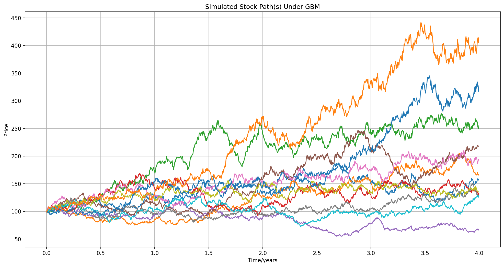
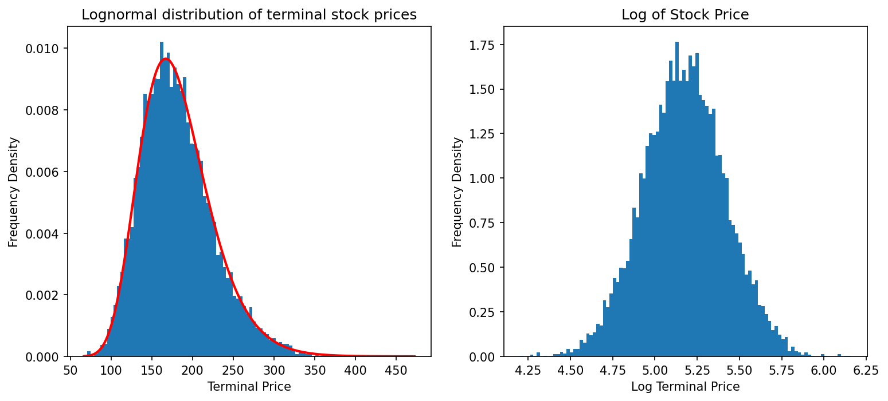
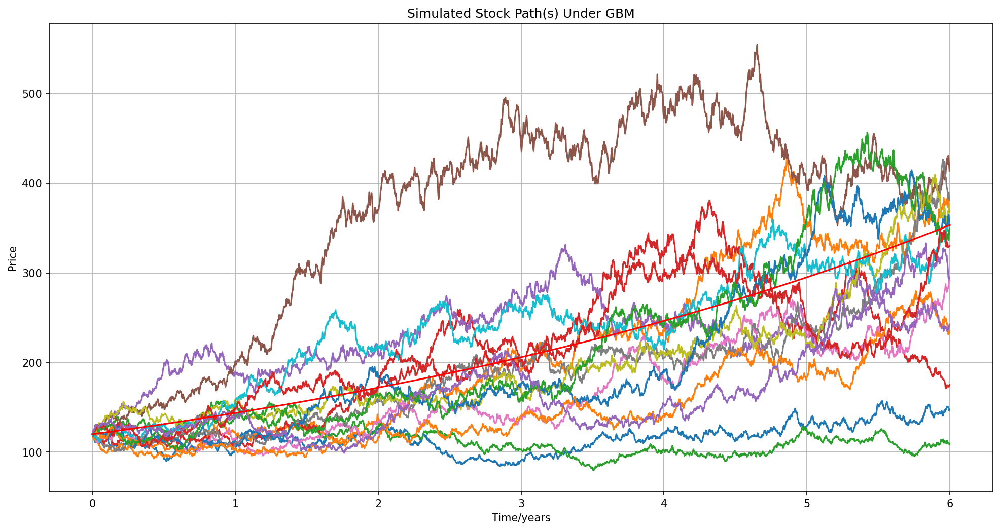

# monte-carlo-options-pricing
Project exploring how Monte Carlo methods can be used for European option pricing, and compares the results against the analytical Black-Scholes-Merton formula.
Plots paths of stock prices under Geometric Brownian Motion, and demonstrates the lognormal distribution of these prices.

---

## Summary

  - Simulated stock prices using Geometric Brownian Motion (GBM).
  - Implemented Monte Carlo estimation of option prices by discounting expected payoffs.
  - Compared simulated prices to analytical closed-form Black-Scholes prices to show convergence.
  - Includes scripts for visualising GBM paths and the lognormal distribution of terminal prices.

---

## Example Results
```bash
          Simulated Monte Carlo Price  Analytical BSM price  Absolute Difference  Percentage Difference
n
250                          6.443502              8.113484             1.669982              20.582808
1000                         7.986590              8.113484             0.126894               1.563990
2500                         7.930739              8.113484             0.182745               2.252365
7500                         8.180436              8.113484            -0.066952              -0.825187
25000                        8.092113              8.113484             0.021371               0.263403
75000                        8.104982              8.113484             0.008502               0.104796
250000                       8.096899              8.113484             0.016585               0.204419
750000                       8.113277              8.113484             0.000207               0.002553
2500000                      8.112597              8.113484             0.000888               0.010942
7500000                      8.119561              8.113484            -0.006077              -0.074894
25000000                     8.114160              8.113484            -0.000676              -0.008329
```
---

## Installation
```bash
git clone https://github.com/jjustin-liu/monte-carlo-options-pricing.git
cd monte-carlo-options-pricing
pip install -r requirements.txt
```

## Usage
Run individual scripts to see results:
```bash
cd src
python convergence.py
python lognorm.py
python GBMPlotter.py
python GBMComparison.py
```

---

## Images




